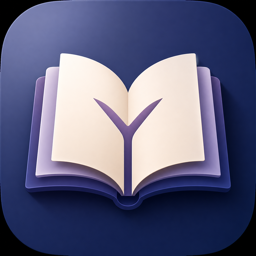
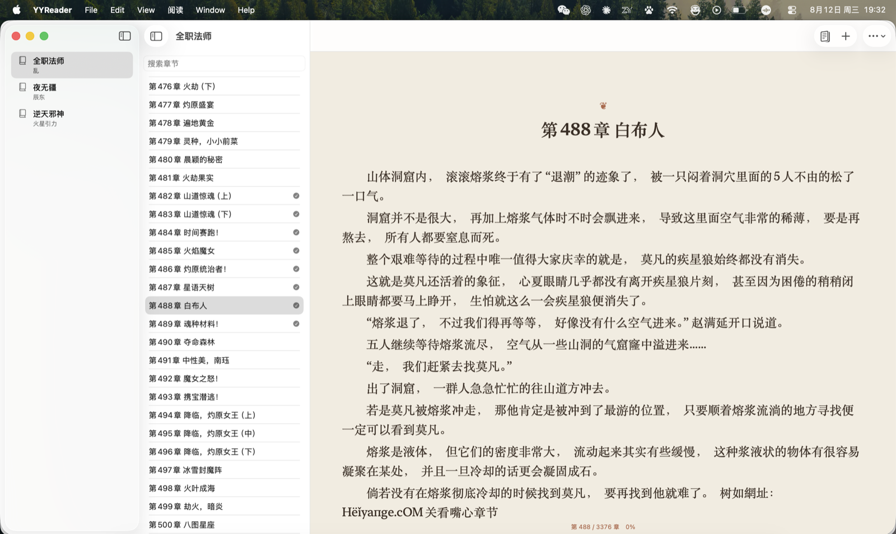
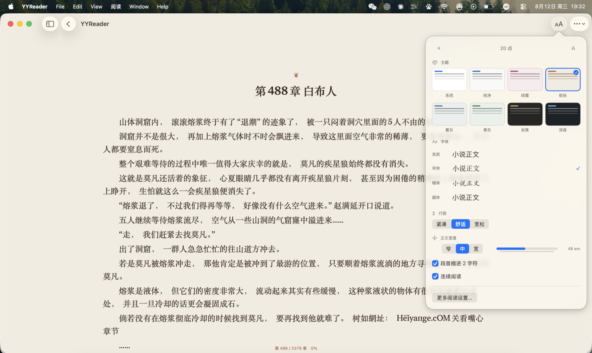
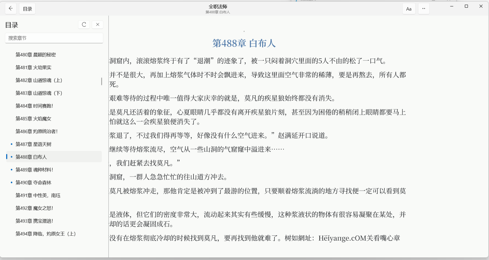
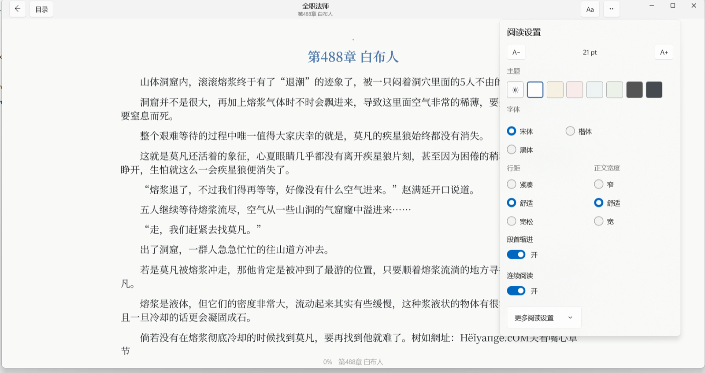

<div align="center">
  
  <h1>YYReader</h1>
  <p><strong>原生、安静、适合长时间阅读的跨平台小说阅读器</strong></p>
  <p>粘贴章节网页，YYReader 会识别书籍、目录与正文，并以系统原生控件呈现干净的阅读界面。</p>

  <p>
    <a href="https://github.com/YangChen-cn/YYReader/releases/tag/v1.2.2"></a>
    
    
    
    
  </p>
</div>

## 快速下载

| 平台 | 安装包 | 系统要求 |
| --- | --- | --- |
| **macOS** | [下载 YYReader 1.2.2 arm64 DMG](https://github.com/YangChen-cn/YYReader/releases/download/v1.2.2/YYReader-1.2.2-arm64.dmg) | Apple 芯片，macOS 15 或更高版本 |
| **Windows** | [下载 YYReader 1.2.2 x64 安装程序](https://github.com/YangChen-cn/YYReader/releases/download/v1.2.2/YYReader-Setup-x64-1.2.2.exe) | x64 Windows 10 1809 或更高版本，推荐 Windows 11 |

也可以前往 [YYReader 1.2.2 Release](https://github.com/YangChen-cn/YYReader/releases/tag/v1.2.2) 查看校验信息和完整发布说明。

> macOS 版本使用 ad-hoc 签名且尚未经过 Apple 公证，首次启动时可能需要在 Finder 中右键 YYReader 并选择“打开”。Windows 安装程序尚未使用商业代码签名，SmartScreen 可能提示“未知发布者”。

## 界面预览

YYReader 在 macOS 与 Windows 上分别使用 SwiftUI 和 WinUI 3 构建，保留各自平台熟悉的窗口、目录与设置体验；网页只负责提供内容，正文始终由原生控件渲染。

<h3 align="center">macOS</h3>

<table>
  <tr>
    <td width="50%"></td>
    <td width="50%"></td>
  </tr>
  <tr>
    <td align="center"><sub>三栏书架、目录与原生正文阅读</sub></td>
    <td align="center"><sub>沉浸阅读、主题、字体与版式调节</sub></td>
  </tr>
</table>

<h3 align="center">Windows</h3>

<table>
  <tr>
    <td width="50%"></td>
    <td width="50%"></td>
  </tr>
  <tr>
    <td align="center"><sub>可收起目录、章节状态与连续阅读</sub></td>
    <td align="center"><sub>主题、字体、行距、宽度与缩进设置</sub></td>
  </tr>
</table>

## 为什么选择 YYReader

| 原生阅读 | 本地优先 | 连续沉浸 | 跨端同步 |
| --- | --- | --- | --- |
| macOS 使用 SwiftUI，Windows 使用 WinUI 3；正文不由 WebView 渲染 | 书架、正文缓存和进度保存在本机，支持离线重开 | 支持目录搜索、连续章节、键盘翻页、主题和排版调节 | 通过用户选择的共享文件夹或 `.yyreader` 文件交换书架与阅读位置 |

- 自动识别书名、作者、章节正文、前后章节与目录，并合并网站拆分的章节分页。
- 支持当前章节、后续章节或整本目录的离线下载；后台预取不会阻塞当前阅读。
- 提供字体、字号、行距、段距、正文宽度、段首缩进及明暗主题设置。
- 为 `qidiy.com` 提供专用解析器，其他站点使用通用语义和正文密度解析。
- 遇到必要的 JavaScript 或 Cloudflare 验证时，macOS 使用 WebKit、Windows 使用 WebView2 获取最终页面；提取后的正文仍回到原生阅读器。

## 文件夹同步

YYReader 不绑定 iCloud 或任何云服务。你可以选择 iCloud Drive、Dropbox、OneDrive、Syncthing、NAS 或普通共享目录，应用会在其中使用以下结构：

```text
YYReaderSync/
├── mac.json
└── windows.json
```

- Mac 只写 `mac.json`，Windows 只写 `windows.json`，双方读取对端快照。
- 书籍按 canonical source URL 合并；阅读位置只向目录中更后的章节或同章更后的段落推进。
- 不同步正文缓存、Cookie、登录信息或 WebView 状态。
- 本地变化只发布本机快照；完整合并仅在启动、回到前台、手动同步或检测到对端文件变化时执行。
- 共享文件夹暂时不可访问时不会修改或清空本地书架。

不想使用自动同步时，也可以通过 `.yyreader`、JSON 文件或剪贴板手动导入、导出书架。格式说明见 [BookshelfTransfer v1](shared/bookshelf-transfer/README.md) 和 [SyncSnapshot](shared/folder-sync/README.md)。

## 基本使用

1. 点击工具栏中的“添加网页”，粘贴小说章节 URL。
2. 当前章节解析完成后即可阅读；完整目录可随后按需加载或手动刷新。
3. 双击章节、按 Return，或点击“继续阅读”进入沉浸模式。
4. 在阅读设置中调整主题、字体、间距和正文宽度。
5. 如需跨设备使用，在同步设置中选择双方都能访问的共享文件夹。

macOS 快捷键：

- `⌘L`：添加网页。
- `⌘[` / `⌘]`：上一章 / 下一章。
- 方向键：整页或小幅滚动正文。

## 1.2.2 更新摘要

- 双端通用解析器加强正文容器、书名作者、章节导航和噪声清理，适配更多真实网站结构。
- 完整目录刷新支持多页遍历、首页最新章节预览替换和 DOM 顺序保留；整书下载会先取得完整目录。
- 修复正文旁大量章节链接造成的目录误判、完整目录自引用循环、`序言` 识别和章节分页 URL 重复。
- 统一 Mac/Windows 的无目录书籍 identity 与 metadata 规则；真实目录被发现后可在安全条件下恢复目录能力。
- macOS 在书架直接提供继续阅读、刷新目录、下载、添加和删除操作，减少进入阅读模式前的额外步骤。

完整内容见 [YYReader 1.2.2 发布说明](RELEASE_NOTES.md)。

## 技术架构

| | macOS | Windows |
| --- | --- | --- |
| UI | SwiftUI | WinUI 3 |
| 语言 | Swift 6，严格并发检查 | C#，.NET 8 |
| 数据 | SwiftData | SQLite |
| 网页验证 | WebKit | WebView2 |
| 正文渲染 | `ScrollView` + `LazyVStack` + `Text` | WinUI 原生文本控件 |

两个客户端共用 URL canonicalization、BookshelfTransfer 和 SyncSnapshot 数据约定。通用网页解析的双端对齐规则见 [通用小说解析器说明](shared/generic-parser/README.md)；macOS 使用 SwiftSoup 2.13.5 与 XcodeGen，Windows 的详细结构和开发要求见 [Windows README](windows/README.md)。

<details>
<summary><strong>从源码构建 macOS</strong></summary>

环境要求：macOS 15+、Xcode 26+、XcodeGen。

```bash
./script/build_and_run.sh run
```

运行完整测试：

```bash
xcodegen generate
xcodebuild test \
  -project YYReader.xcodeproj \
  -scheme YYReader \
  -destination 'platform=macOS,arch=arm64' \
  -derivedDataPath DerivedData
```

生成经过便携性、签名和 DMG 完整性检查的 arm64 安装包：

```bash
./script/package_release.sh
```

</details>

<details>
<summary><strong>从源码构建 Windows</strong></summary>

需要 .NET 8 SDK、Visual Studio 2022 的 C++/Windows 开发工具、Windows SDK、Windows App SDK 与 Inno Setup 6。

```powershell
dotnet test .\windows\YYReader.Windows.Tests\YYReader.Windows.Tests.csproj
.\windows\scripts\package-release.ps1
```

</details>

## 隐私与使用边界

YYReader 不包含或分发小说正文，也不会提交抓取后的网页、Cookie 或验证凭据。应用不会自动解决 CAPTCHA，不会绕过登录、付费墙或网站访问控制。第三方网站结构和访问策略可能变化，请遵守目标网站的服务条款与内容版权要求。

## 项目

- 作者：YangChen
- 仓库：[YangChen-cn/YYReader](https://github.com/YangChen-cn/YYReader)
- 发布说明：[RELEASE_NOTES.md](RELEASE_NOTES.md)

当前仓库尚未声明开源许可证。源代码公开不等于自动授予复制、修改或再分发许可。
