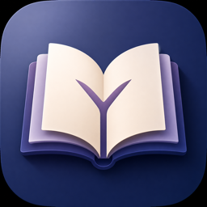
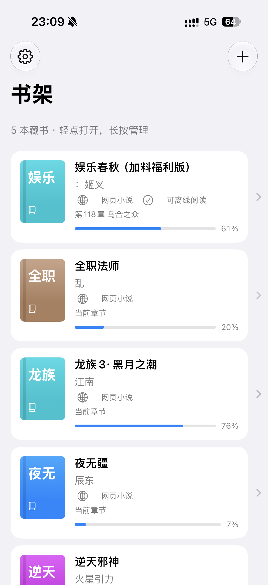
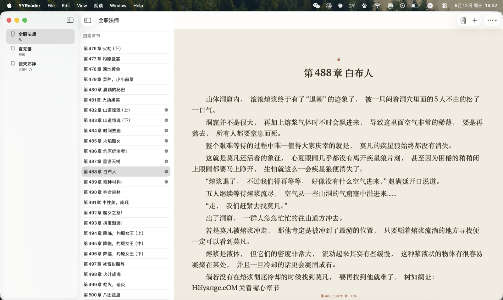
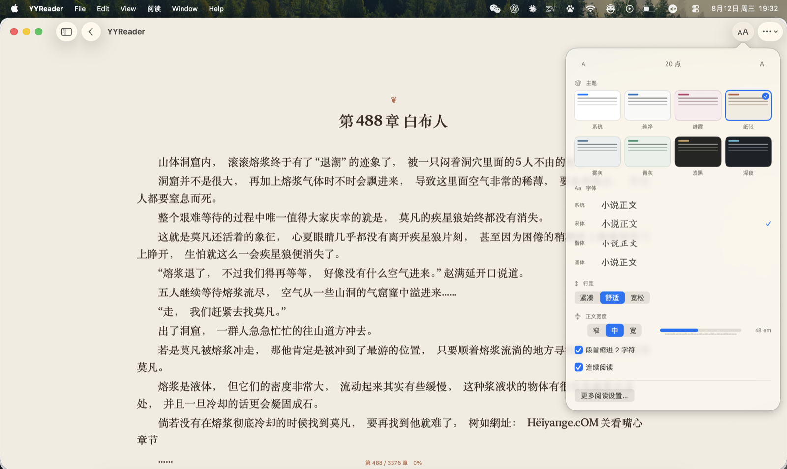
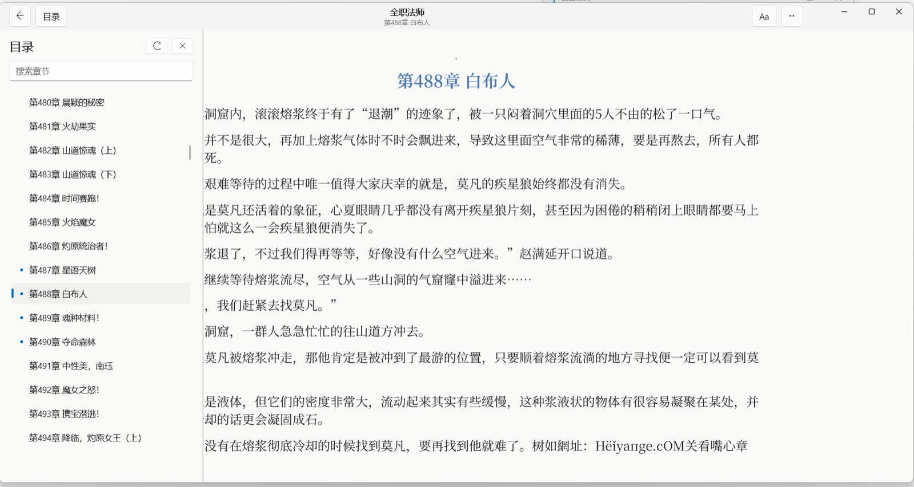
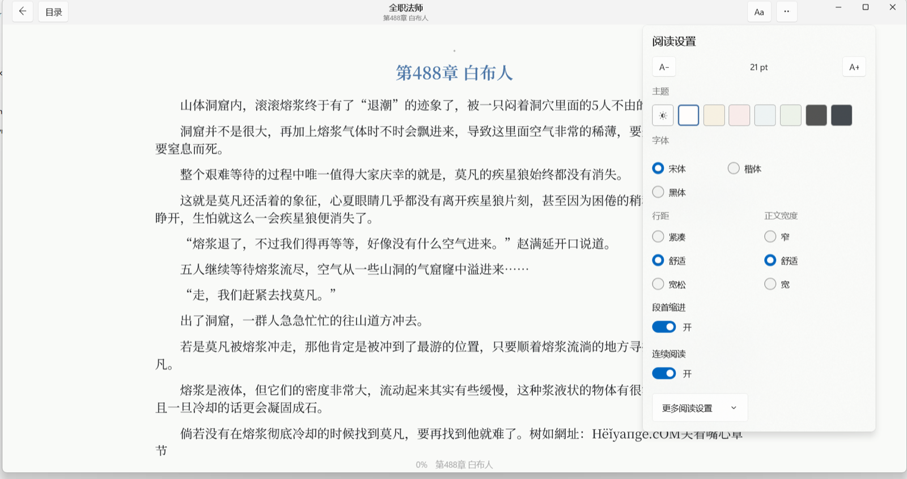

<div align="center">
  
  <h1>YYReader</h1>
  <p><strong>一本小说，随处接着读。</strong></p>
  <p>适用于 macOS、iPhone、iPad 和 Windows 的原生小说阅读器。<br>添加小说网址或导入 TXT，让书架、正文与阅读进度各归其位。</p>
  <p>
    
    
    
  </p>
  <p>
    <a href="#下载与安装">下载</a> ·
    <a href="#界面一览">界面</a> ·
    <a href="#阅读体验">功能</a> ·
    <a href="#开始阅读">使用</a> ·
    <a href="#跨设备接续">同步</a> ·
    <a href="#开发与文档">开发</a>
  </p>
</div>

## 下载与安装

| 平台 | 最新版本 | 下载 | 系统要求 |
| --- | --- | --- | --- |
| **macOS** | 1.3.0 | [DMG · arm64](https://github.com/YangChen-cn/YYReader/releases/download/v1.3.0/YYReader-1.3.0-arm64.dmg) | Apple 芯片，macOS 15+ |
| **iPhone / iPad** | 1.0.0 | [IPA · arm64](https://github.com/YangChen-cn/YYReader/releases/download/ios-v1.0.0/YYReader-iOS-1.0.0-resign.ipa) | iOS / iPadOS 18+ |
| **Windows** | 1.3.0 | [安装程序 · x64](https://github.com/YangChen-cn/YYReader/releases/download/v1.3.0/YYReader-Setup-x64-1.3.0.exe) | Windows 10 1809+，推荐 Windows 11 |

**iOS 已完成 iPhone 真机签名安装与阅读验证。** 下载 IPA 后，使用自己的侧载工具重新签名安装；操作见 [iOS 安装指南](docs/IOS_DEVELOPMENT.md#使用-sidestore-在手机端安装与续签)。

发布说明与校验值：[桌面版 1.3.0](https://github.com/YangChen-cn/YYReader/releases/tag/v1.3.0) · [iOS 1.0.0](https://github.com/YangChen-cn/YYReader/releases/tag/ios-v1.0.0) · [历史更新](RELEASE_NOTES.md)

## 界面一览

### iPhone / iPad

随手打开书架，回到上次读到的地方。以下为作者提供的 iPhone 真机截图。

<table>
  <tr>
    <td width="50%" align="center"></td>
    <td width="50%" align="center"></td>
  </tr>
  <tr>
    <td align="center">书架 · 书封、作者与阅读进度</td>
    <td align="center">阅读 · 原生正文与舒适排版</td>
  </tr>
</table>

### macOS

书架、目录与正文并排展开，阅读和查找章节都留在同一个窗口。

<table>
  <tr>
    <td width="50%"></td>
    <td width="50%"></td>
  </tr>
  <tr>
    <td align="center">书架 · 三栏布局与章节目录</td>
    <td align="center">阅读 · 主题、字体与版式调节</td>
  </tr>
</table>

### Windows

熟悉的桌面操作方式，配合可收起的目录和完整的阅读设置。

<table>
  <tr>
    <td width="50%"></td>
    <td width="50%"></td>
  </tr>
  <tr>
    <td align="center">书架 · 章节状态与连续阅读</td>
    <td align="center">阅读 · 字体、间距与宽度设置</td>
  </tr>
</table>

## 阅读体验

| 功能 | 体验 |
| --- | --- |
| **网址与 TXT** | 识别网页中的书名、作者、目录与正文，合并网站拆分的章节；本地 TXT 支持 UTF-8、GBK / GB18030。 |
| **原生正文** | 使用系统原生文字控件呈现正文，支持目录搜索、章节切换与阅读位置恢复。 |
| **适合自己的排版** | 调整主题、字体、字号、行距、段距、正文宽度与段首缩进，也可使用单栏或双栏论文模式。 |
| **顺手的翻页** | iOS 支持上下滚动与左右翻页，轻点正文中央显示阅读菜单；桌面端提供连续阅读与键盘操作。 |
| **离线继续读** | 读过的章节保存在本机，可按需缓存当前章、后续章节或全书；下一章预取在后台进行。 |
| **跨设备接续** | 通过共享文件夹或书架文件交换书籍信息与阅读进度，在另一台设备接着读。 |

## 开始阅读

1. **添加一本书**：粘贴小说网址，或导入本地 TXT 文件。
2. **打开正文**：从书架打开小说，选择章节；已缓存的内容可直接离线阅读。
3. **调整阅读方式**：在阅读设置选择喜欢的主题、字体和排版。iOS 可切换上下滚动与左右翻页。

<details>
<summary>macOS 常用快捷键</summary>

| 快捷键 | 操作 |
| --- | --- |
| `⌘L` | 添加网页 |
| `⌘[` / `⌘]` | 上一章 / 下一章 |
| 方向键 | 整页或小幅滚动正文 |

</details>

## 跨设备接续

在同步设置中选择各设备都能访问的共享位置，并启用文件夹同步。可使用 iCloud Drive、Dropbox、OneDrive、Syncthing、NAS 或普通共享目录；iOS 也可以直接选择已有的 `YYReaderSync` 文件夹。

同步交换书架、书籍信息与阅读进度。正文缓存留在本机，本地 TXT 需要在各设备分别导入。也可以通过 `.yyreader`、JSON 文件或剪贴板导入、导出书架。

Windows 与 iOS 的进度交换需要支持 iOS 快照的 Mac 版本中转，或使用书架文件传输。

<details>
<summary>同步文件与合并规则</summary>

```text
YYReaderSync/
├── mac.json
├── ios.json
└── windows.json
```

- Mac 只写 `mac.json`，iOS 只写 `ios.json`，两者读取其他端快照。Windows 当前只写 `windows.json`、读取 `mac.json`。
- 书籍按规范化来源 URL 合并；阅读位置向更后的章节或同章更后的段落推进。
- 本地变化发布本机快照；启动、回到前台、手动同步或检测到对端变化时读取合并。
- 文件夹暂时不可访问时保留本地书架；同步文件不包含正文缓存、Cookie 或登录信息。

格式说明：[书架传输](shared/bookshelf-transfer/README.md) · [文件夹同步](shared/folder-sync/README.md)

</details>

## 开发与文档

macOS 与 iOS 共用解析、加载、缓存、数据模型和阅读进度逻辑；平台差异集中在导航、文件选择和系统交互。

[iOS 开发与安装](docs/IOS_DEVELOPMENT.md) · [Windows 开发](windows/README.md) · [通用解析器](shared/generic-parser/README.md) · [发布记录](RELEASE_NOTES.md)

<details>
<summary>技术架构</summary>

| | macOS / iOS | Windows |
| --- | --- | --- |
| 界面 | SwiftUI | WinUI 3 |
| 语言 | Swift 6，严格并发检查 | C#，.NET 8 |
| 数据 | SwiftData | SQLite |
| 网页验证 | WebKit | WebView2 |
| 正文 | ScrollView、LazyVStack、Text | WinUI 原生文本控件 |

macOS / iOS 使用 SwiftSoup 2.13.5 和 XcodeGen；三端共用 URL 规范化、书架传输与同步数据约定。

</details>

<details>
<summary><strong>从源码构建 macOS</strong></summary>

环境要求：macOS 15+、Xcode 26+、XcodeGen。

```bash
./script/build_and_run.sh run
```

运行完整测试：

```bash
xcodegen generate
xcodebuild test \
  -project YYReader.xcodeproj \
  -scheme YYReader \
  -destination 'platform=macOS,arch=arm64' \
  -derivedDataPath DerivedData
```

生成经过便携性、签名和 DMG 完整性检查的 arm64 安装包：

```bash
./script/package_release.sh
```

</details>

<details>
<summary><strong>从源码构建和调试 iOS / iPadOS</strong></summary>

工程内选择 `YYReaderIOS` scheme，再选择 iPhone 或 iPad 模拟器并按 ⌘R。需要先在 Xcode Settings → Components 安装 iOS 运行时。Canvas 预览位于 `YYReaderIOS/Views/MobileLibraryPreview.swift`，使用自造文本和内存数据库。

```bash
./script/build_ios.sh simulator   # 构建、安装并启动模拟器
./script/build_ios.sh test        # 在模拟器运行共享逻辑测试
./script/build_ios.sh ipa         # 生成供侧载工具重新签名的设备版 IPA
./script/build_ios.sh release     # 发布用 arm64 Release IPA 与 SHA-256 校验文件
```

IPA 位于 `dist/iOS/YYReader-iOS-1.0.0-resign.ipa`。这是未签名包，需要使用自己的 Apple ID / 证书和描述文件重新签名后才能安装。模拟器无需开发者证书。真机调试需在 Xcode 的 Signing & Capabilities 选择 Team，并在手机开启开发者模式。

已有开发者签名资源时：

```bash
YYREADER_IOS_TEAM_ID=你的TeamID ./script/build_ios.sh signed
```

日常开发使用 Debug，`release` 使用 iOS Release；均不构建 Mac Release 或 DMG。完整的操作与手动验收步骤见 [iOS 开发说明](docs/IOS_DEVELOPMENT.md)。

</details>

<details>
<summary><strong>从源码构建 Windows</strong></summary>

需要 .NET 8 SDK、Visual Studio 2022 的 C++/Windows 开发工具、Windows SDK、Windows App SDK 与 Inno Setup 6。

```powershell
dotnet test .\windows\YYReader.Windows.Tests\YYReader.Windows.Tests.csproj
.\windows\scripts\package-release.ps1
```

</details>


## 项目与使用说明

**作者：YangChen** · [GitHub 仓库](https://github.com/YangChen-cn/YYReader)

小说内容来自用户添加的网页或本地 TXT。应用不会自动解决 CAPTCHA，或绕过登录、付费墙与网站访问控制；请遵守来源网站的条款与内容版权要求。

仓库尚未声明开源许可证，源代码公开不代表自动授予复制、修改或再分发许可。
