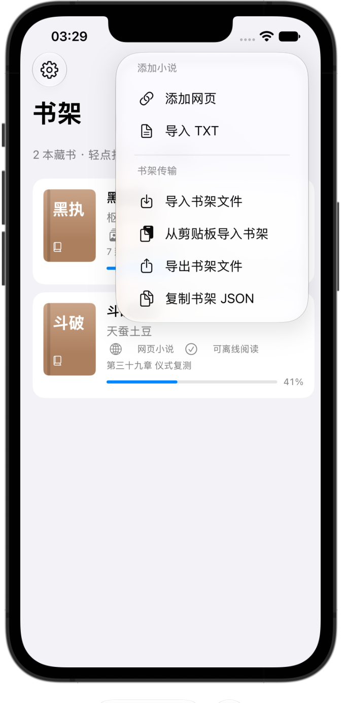

<div align="center">
  
  <h1>YYReader</h1>
  <p><strong>小说与漫画，随处接着读。</strong></p>
  <p>macOS、iPhone 与 iPad 的原生小说和漫画阅读器，Windows 提供小说阅读。<br>添加网页或导入 TXT，把书架、离线缓存和阅读进度留在自己的设备上。</p>
  <p>
    <a href="https://github.com/YangChen-cn/YYReader/releases/tag/v1.4.1"></a>
    <a href="https://github.com/YangChen-cn/YYReader/stargazers"></a>
    
  </p>
  <p>
    
    
    
    
  </p>
  <p>
    <a href="#下载与安装">下载安装</a> ·
    <a href="#界面一览">界面一览</a> ·
    <a href="#阅读体验">阅读体验</a> ·
    <a href="#论文伪装模式">论文伪装</a> ·
    <a href="#开始阅读">开始阅读</a> ·
    <a href="#跨设备接续">跨设备接续</a> ·
    <a href="#开发与文档">开发文档</a>
  </p>
</div>

## 下载与安装

| 平台 | 最新版本 | 安装包 | 系统要求 |
| --- | --- | --- | --- |
| **macOS** | **1.4.1** | [DMG · arm64](https://github.com/YangChen-cn/YYReader/releases/download/v1.4.1/YYReader-1.4.1-arm64.dmg) | Apple 芯片，macOS 15+ |
| **iPhone / iPad** | **1.4.1** | [IPA · arm64](https://github.com/YangChen-cn/YYReader/releases/download/ios-v1.4.1/YYReader-iOS-1.4.1-resign.ipa) | iOS / iPadOS 18+ |
| **Windows** | 1.3.0 | [安装程序 · x64](https://github.com/YangChen-cn/YYReader/releases/download/v1.3.0/YYReader-Setup-x64-1.3.0.exe) | Windows 10 1809+，推荐 Windows 11 |

iOS IPA 需要用 SideStore、Sideloadly 等工具自行签名安装，续签由侧载工具管理；[安装与续签指南](docs/IOS_DEVELOPMENT.md#使用-sidestore-在手机端安装与续签)。作者已完成过 iPhone 真机签名安装、阅读与同步的使用流程。

[macOS 1.4.1 发布说明](https://github.com/YangChen-cn/YYReader/releases/tag/v1.4.1) · [iOS 1.4.1 发布说明](https://github.com/YangChen-cn/YYReader/releases/tag/ios-v1.4.1) · [完整更新记录](RELEASE_NOTES.md)

## 界面一览

### iPhone / iPad

从书架直接接着读，轻点正文中间唤出菜单。添加网页、导入 TXT 和书架传输，都从右上角的「＋」开始。iPad 使用独立的书架和阅读界面，目录按需打开；漫画默认开启「横屏自动双页」：横屏宽视口自动切到左右双页，竖屏恢复原来的阅读方式；可在设置中关闭。

<table>
  <tr>
    <td width="33%" align="center" valign="top"></td>
    <td width="34%" align="center" valign="top"></td>
    <td width="33%" align="center" valign="top"></td>
  </tr>
  <tr>
    <td align="center"><strong>收藏故事</strong><br>书封、作者与阅读进度</td>
    <td align="center"><strong>接着阅读</strong><br>原生正文与舒适排版</td>
    <td align="center"><strong>轻松添加</strong><br>网址、TXT 与书架文件</td>
  </tr>
</table>

前两张为作者提供的 iPhone 真机截图，右侧为模拟器中的添加菜单示意。

### macOS

书架、目录与阅读区可并排展开，也可收起侧栏专心阅读。设置统一放在齿轮入口；看漫画时，宽窗口自动双页，切到上下滚动会收窄过宽的窗口，退出后恢复原宽度。

<table>
  <tr>
    <td width="50%"></td>
    <td width="50%"></td>
  </tr>
  <tr>
    <td align="center">书架与目录 · 查找章节更方便</td>
    <td align="center">文字阅读 · 主题、字体与版式调节</td>
  </tr>
</table>

### Windows

提供原生小说阅读、TXT 导入、离线缓存和书架同步。当前发布版为 1.3.0，支持论文伪装模式；漫画阅读与导入类型选择目前在 Mac / iOS 提供。

<table>
  <tr>
    <td width="50%"></td>
    <td width="50%"></td>
  </tr>
  <tr>
    <td align="center">目录与正文 · 连续阅读</td>
    <td align="center">阅读设置 · 字体、间距与宽度</td>
  </tr>
</table>

## 阅读体验

以下功能以 Mac / iOS 1.4.1 为准，Windows 的支持范围在对应条目中说明。

| 功能 | 使用方式 |
| --- | --- |
| **按内容导入** | Mac / iOS 添加网址时可选自动识别、文字小说或漫画。选择随书籍保存，后续加载、刷新目录和离线下载沿用；旧书默认自动识别。 |
| **原生小说阅读** | 支持上下连续滚动，iPhone / iPad 还可左右分页；提供目录搜索、跨章接续与阅读位置恢复。本地 TXT 支持 UTF-8、GBK / GB18030，导入后可编辑书名与作者、离线阅读。 |
| **Mac / iPad 漫画双页** | 左右翻页提供自动、单页、双页布局。Mac 宽窗口自动组合竖图；iPad 默认开启横屏自动左右双页，可关闭；横向大图独占，首图可单页。图片完整等比显示，页间有分隔，组合不跨章；调整窗口或旋转后保留阅读位置。 |
| **iOS 漫画阅读** | 默认上下滚动，也可左右翻页；点击两侧直接切页，拖动时跟手翻页。双击进入放大查看，支持捏合缩放与拖动。 |
| **快速定位** | 漫画页码 Slider 拖动时预览，松手后跳转；前进进入下一话首页，后退恢复上一话末页。iOS 点击书籍直接续读。 |
| **清爽的阅读界面** | iOS 两种阅读方式都可隐藏标题栏与进度栏；Mac / iPad 支持深灰漫画背景。小说可调整主题、字体、字号、行距、段距、宽度与段首缩进。 |
| **论文伪装** | 将小说排成学术论文外观，带模拟标题、摘要、引用与图表，支持单栏和双栏；保留原文与阅读位置。Mac / Windows 可用自定义快捷键快速切换。 |
| **预取与离线缓存** | 默认预取小说最多 3 章、漫画最多 10 张图片；可主动下载当前章、后续章节或全书。已下载内容留在本机。 |
| **看得见的缓存占用** | 设置中查看总大小及每本书占用，清理全部或单本缓存；每本漫画预算 512 MB，超出后优先清理已读章节，保留当前章与未读内容。 |
| **书架与进度同步** | 共享文件夹、书架文件或剪贴板传输书籍信息与阅读进度；正文与图片缓存不随同步传输。 |
| **更新提醒** | Mac / iOS 自动检查各自的 GitHub 发布，书架上展开更新说明。Mac 支持带进度的下载及安装重启；iOS 提供 IPA 下载链接，由侧载工具重新签名安装。可暂时忽略提醒，之后从设置手动检查更新。 |

漫画专用适配包括瓜子漫画、再漫画、好多漫、漫画站和多看漫画。其他站点通过正文区域、图片序列、尺寸及上下话导航综合识别；自动模式在小说正文不可信时尝试高置信度漫画解析，手动漫画模式可明确指定内容类型。广告图集与证据不足的页面会提示失败，正常网页中符合识别条件的 `blob:` 图片也可按需读取并缓存。详见 [漫画阅读与适配说明](docs/MANGA_SUPPORT.md)。

## 论文伪装模式

把小说换成论文的样子，原文照常阅读。页面带有模拟的论文标题、作者、摘要、关键词、引用、公式和图表；宽屏可用双栏，窄屏自动单栏，切回普通阅读后仍停在原来的位置。

- **Mac**：点击阅读工具栏的「论文伪装模式」，或按默认 `⌃⌥P`；阅读设置可调整栏数和快捷键。
- **iPhone / iPad**：阅读设置 → 排版 →「学术论文」。使用上下滚动，iPhone 窄屏显示单栏，iPad 可选择栏数。
- **Windows**：点击阅读工具栏的「论文」，或按默认 `Ctrl+Alt+P`；阅读设置可调整栏数和快捷键。

标题、摘要、引用与图表用于模拟论文外观，不是小说的真实学术分析。模式只改变呈现方式，不改写书籍正文。

## 开始阅读

1. **添加**：粘贴章节或目录网址，选择自动识别、文字小说或漫画；也可导入自己的 TXT。
2. **续读**：在书架点开书籍，回到之前读到的位置。iOS 不再先打开目录，新书从首章开始。
3. **调整**：打开阅读设置，选择翻页方式、主题和布局。漫画默认 Mac 左右翻页、iOS 上下滚动，小说与漫画分别保存设置。
4. **离线**：提前缓存需要的章节，再在无网络时继续阅读；在本地缓存管理中按需清理。

<details>
<summary>macOS 常用快捷键</summary>

| 快捷键 | 操作 |
| --- | --- |
| `⌘L` | 添加网页 |
| `⌘[` / `⌘]` | 上一章 / 下一章 |
| `⌘⇧D` | 显示或隐藏目录 |
| `⌘⌥A` | 阅读外观设置 |
| `⌃⌥P` | 切换论文伪装模式，可自定义 |
| 方向键 | 小说滚动；漫画左右翻页时切换整组图片 |

</details>

## 跨设备接续

在同步设置中选择各设备都能访问的共享文件夹，并启用同步。可使用 iCloud Drive、Dropbox、OneDrive、Syncthing、NAS 或普通共享目录；iOS 可选择共享父目录，或直接选择已有的 `YYReaderSync` 文件夹。

同步交换书架、书籍信息与阅读进度，正文和漫画图片保留在本机。本地 TXT 需在各设备分别导入；网页导入类型是本机偏好，不加入同步快照。也可以通过 `.yyreader`、JSON 文件或剪贴板传输书架。

Windows 与 iOS 的进度交换目前需要 Mac 中转，或使用书架文件传输。

<details>
<summary>同步文件与合并规则</summary>

```text
YYReaderSync/
├── mac.json
├── ios.json
└── windows.json
```

- 各端只写自己的快照；Mac 与 iOS 读取其他端，Windows 当前读取 Mac 快照。
- 书籍按规范来源 URL 合并，阅读位置向更后章节或同章更后位置推进。
- 文件夹暂不可访问或快照无效时保留本地书架，不清空缓存。
- 快照不包含正文、漫画图片、Cookie 或登录信息。

[书架传输格式](shared/bookshelf-transfer/README.md) · [同步格式](shared/sync/README.md)

</details>

## 开发与文档

Mac 与 iOS 共用解析、加载、缓存、SwiftData 数据模型与阅读进度逻辑。界面使用 SwiftUI，Swift 6 严格并发，SwiftSoup 2.13.5 与 XcodeGen 管理工程；Windows 使用 WinUI 3、C# / .NET 8 和 SQLite。

[iOS 开发与安装](docs/IOS_DEVELOPMENT.md) · [漫画实现与 Windows 交接](docs/MANGA_SUPPORT.md) · [应用更新](docs/APP_UPDATES.md) · [Windows 开发](windows/README.md) · [通用小说解析](shared/generic-parser/README.md) · [更新记录](RELEASE_NOTES.md)

<details>
<summary>从源码构建 macOS</summary>

需要 Xcode、XcodeGen 和 macOS 15+。Debug 运行与 Release 打包使用现有脚本：

```bash
./script/build_and_run.sh run
./script/package_release.sh
```

</details>

<details>
<summary>从源码构建 iOS / iPadOS</summary>

在 Xcode 选择 `YYReaderIOS` scheme 和已有 iPhone / iPad 模拟器，按 ⌘R。日常调试只复用一台模拟器。

```bash
YYREADER_SIMULATOR_ID=当前模拟器UDID ./script/build_ios.sh simulator
./script/build_ios.sh release
```

Release IPA 位于 `dist/iOS/YYReader-iOS-1.4.1-resign.ipa`。模拟器无需开发者证书；IPA 需要自己的 Apple ID / 证书重新签名。真机调试在 Signing & Capabilities 选择 Team，并在手机开启开发者模式。

已有签名资源时可使用 `YYREADER_IOS_TEAM_ID=你的TeamID ./script/build_ios.sh signed`。完整操作见 [iOS 开发说明](docs/IOS_DEVELOPMENT.md)。

</details>

<details>
<summary>从源码构建 Windows</summary>

需要 .NET 8 SDK、Visual Studio 2022 的 C++ / Windows 开发工具、Windows SDK、Windows App SDK 与 Inno Setup 6。

```powershell
dotnet test .\windows\YYReader.Windows.Tests\YYReader.Windows.Tests.csproj
.\windows\scripts\package-release.ps1
```

</details>

---

**作者：YangChen** · [GitHub](https://github.com/YangChen-cn/YYReader)

内容来自用户添加的网页或本地 TXT；应用不自动解决 CAPTCHA，不绕过登录、付费墙或访问控制。请遵守来源网站的条款与内容版权要求。

仓库尚未声明开源许可证，公开源代码不代表自动授予复制、修改或再分发许可。
